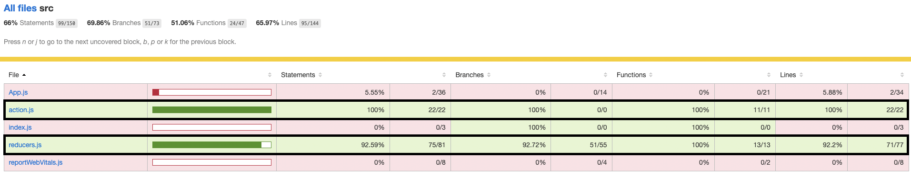

# Unit Test

All the code presented here can be found in `reducers.test.js`. Most of my states are in Redux--`reducers.js`
and `action.js`. Therefore, I will mainly focus on the reducer functionality test.

## Unit test initialization

Before any of the test even start, I will first initialized `userList` as well as `posts`.

```javascript
fetch("https://jsonplaceholder.typicode.com/users")
    .then(res => res.json())
    .then(res => {
            // Initialize redux users
            let newUsers = res.map((u) => {
                return {
                    ...u,
                    passwd: u.address.street,
                    status: "Rice book",
                    following: [...Array(3).keys()].map(i => String((i + 1 + u.id) % res.length))
                }
            })
            state.userList = newUsers
        }
    ).then(() => fetch("https://jsonplaceholder.typicode.com/posts")
        .then(res => res.json())
        .then(res => {
                // Initialize redux posts
                let idToName = new Map()
                state.userList.forEach((u) => idToName.set(u.id, u.name))
                let newPosts = res.map((p) => {
                    return {
                        ...p,
                        userName: idToName.get(p.userId),
                        timeStamp: getCurrentTime()
                    }
                })
                state.posts = newPosts
            }
        ))
```

# Redux states

```javascript
const initialState = {
    user: undefined, // login user
    userList: [], // all users
    posts: [], // all posts
    displayPosts: [], // posts filtered based on query and user.following
    isUserLogin: false, // is user login? if yes true else false
    loginFailed: false, // is user login failed?
    regInvMsg: "", // register failed message, e.g. phone number invalid, not yet 18 years old...etc
};
```

# Test cases

### Login function test

To test login function, I use a json placeholder #1 "Bret" user to login.

```javascript
let newState = RiceBookApp(state, login("Bret", "Kulas Light"));
expect(newState.user.username).toEqual("Bret");
expect(newState.user.passwd).toEqual("Kulas Light");
expect(newState.isUserLogin).toEqual(true);
```

### Adding a post

Add a post created by "Bret"

```javascript
let oldLen = newState.displayPosts.length
let newPost = {
    userId: 1,
    body: "test",
    userName: "Bret",
    timeStamp: getCurrentTime()
}
newState = RiceBookApp(newState, addPost(newPost))
expect(newState.displayPosts.length).toEqual(oldLen + 1)
```

### Update query (search)

Search for the post we just add and check there is only one post

```javascript
newState = RiceBookApp(newState, updateQuery("test"))
expect(newState.displayPosts.length).toEqual(1)
```

### Follow a new user

Since Bret is #1, he follows #2, #3. #4. We add #6 to its follow list. Check follow list grows and number of display
posts increases

```javascript
// Check follow
oldLen = newState.displayPosts.length
let oldFollowLen = newState.user.following.length
newState = RiceBookApp(newState, follow("6"))
expect(newState.user.following.length > oldFollowLen).toBeTruthy()
expect(newState.displayPosts.length > oldLen).toBeTruthy()
```

### Unfollow a user

Vice versa.

```javascript
oldLen = newState.displayPosts.length
oldFollowLen = newState.user.following.length
newState = RiceBookApp(newState, unfollow("6"))
expect(newState.user.following.length < oldFollowLen).toBeTruthy()
expect(newState.displayPosts.length < oldLen).toBeTruthy()
```

### Check profile page

Render out profile page with `newState` and check is `name` is displayed correctly.

```javascript
    // Profile
let store = storeFactory(newState)
let wrapper = mount(
    <Provider store={store}>
        <MemoryRouter initialEntries={['/profile']}>
            <Profile/>
        </MemoryRouter>
    </Provider>)
expect(wrapper.find("#profileUsername").text()).toBe("Name: Leanne Graham")
```

### Try to logout a user

```javascript
    // Check logout
newState = RiceBookApp(newState, logout());
expect(newState.user).toEqual(undefined);
expect(newState.isUserLogin).toEqual(false);
```

### Try to register a user

Try to create a user and check whether his id is `11`. Also check that he can see what correct number of posts. Since we
have added a new post, the number of posts the user can see is
`11 (Bret) + 10 (#2 user) + 10 (#3 user) + 10 (new posts added when registering) = 41`

```javascript
    // Register a new user
let newUser = {
    username: "xxx",
    name: "yyy",
    email: "xxx@xxx.com",
    passwd: "xxx",
    birthday: "1997-01-01",
    phone: "000-000-0000",
    zipcode: "00000",
    passwdConf: "xxx",
}
newState = RiceBookApp(newState, register(newUser))
expect(newState.user.id).toEqual(11)
expect(newState.displayPosts.length).toEqual(41)
oldLen = newState.userList.length
```

### Try to register again

Try to register again with the same username. Number of users doesn't change.

```javascript
oldLen = newState.userList.length
// Register an invalid user
newUser = {
    username: "xxx",
    name: "yyy",
    email: "xxx@xxx.com",
    passwd: "xxx",
    birthday: "1997-01-01",
    phone: "000-000-0000",
    zipcode: "00000",
    passwdConf: "xxx",
}
newState = RiceBookApp(newState, register(newUser))
expect(newState.userList.length).toEqual(oldLen)
```

### Update status

Update user status

```javascript
newState = RiceBookApp(newState, updateStatus("yyy"))
expect(newState.user.status).toEqual("yyy")
```

### Update user infomation

Update user information

```javascript
newUser.name = "kkk"
newState = RiceBookApp(newState, updateInfo(newUser))
expect(newState.user.name).toEqual("kkk")
```

### Test result
As can be seen in the picture circled with black edge. I have reached 90% code coverage!



